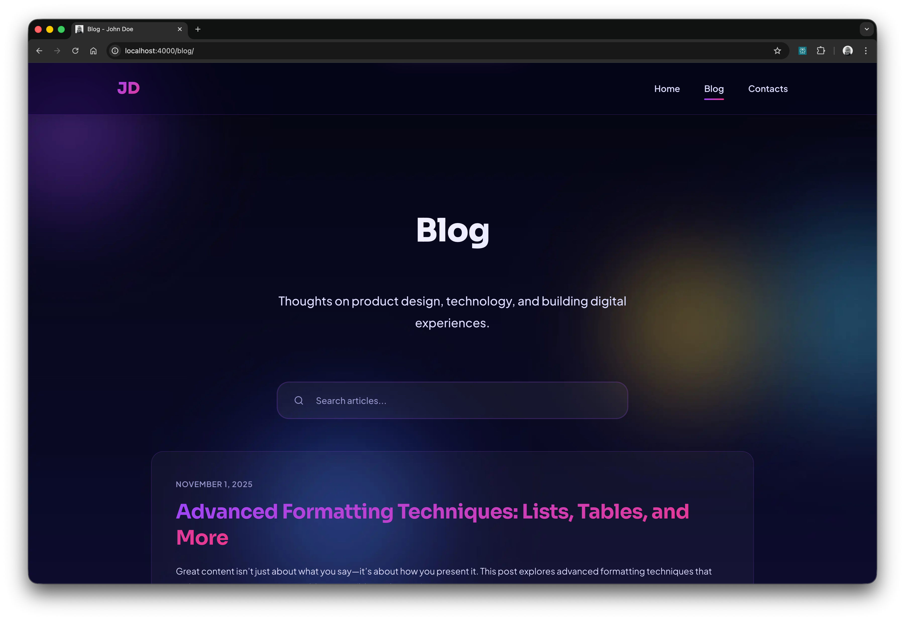
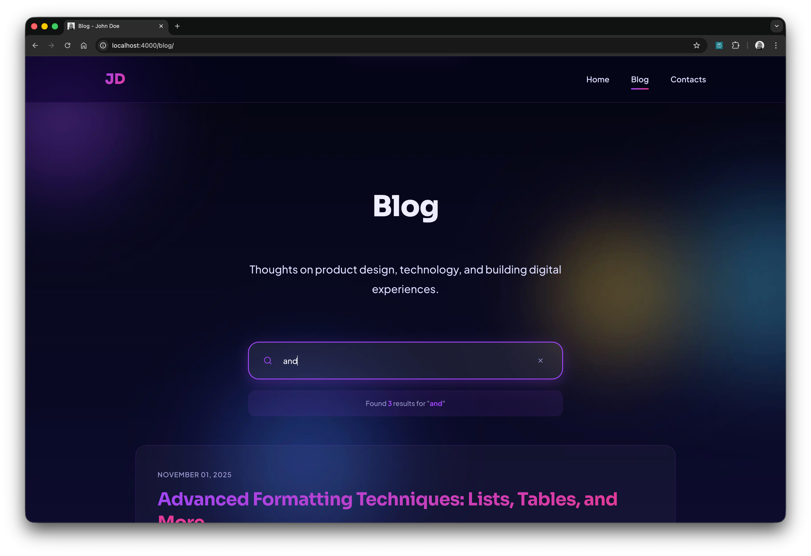
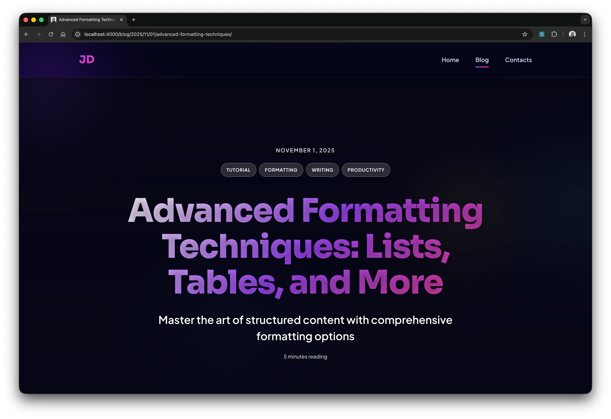
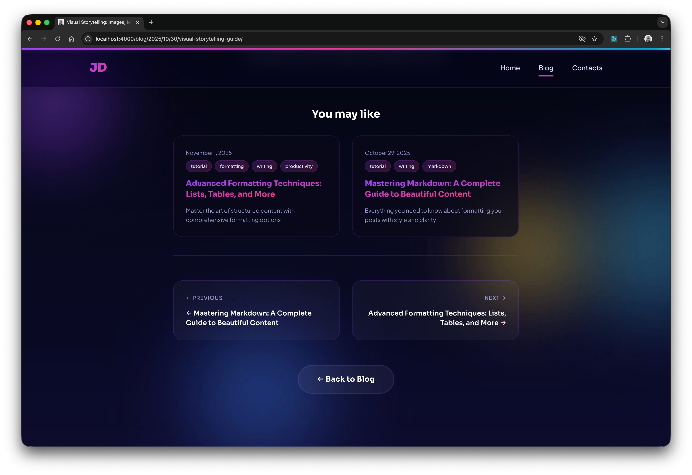
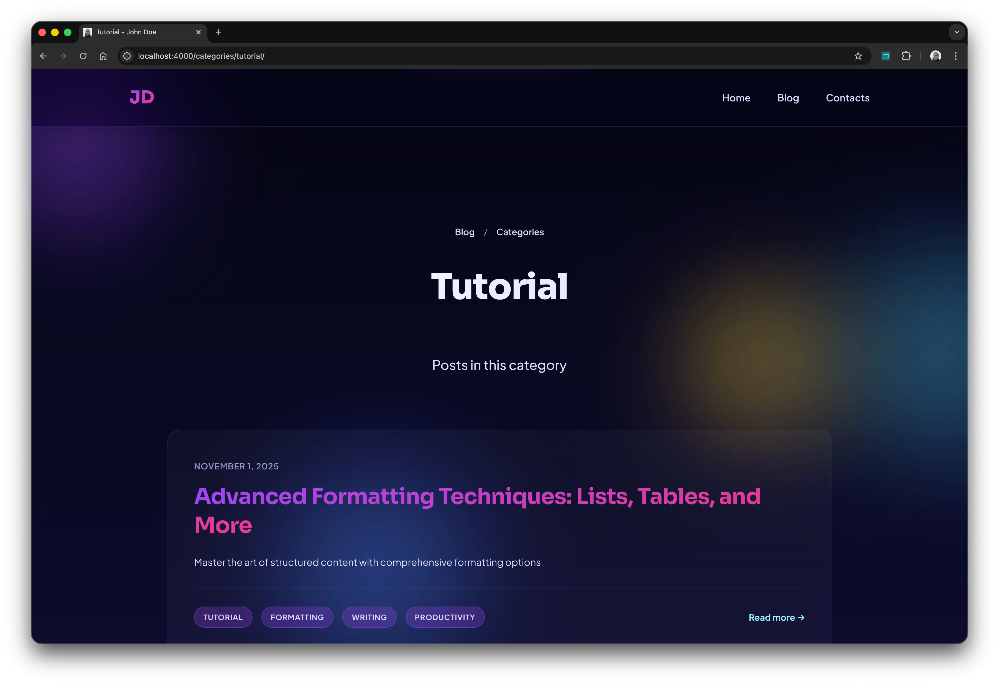
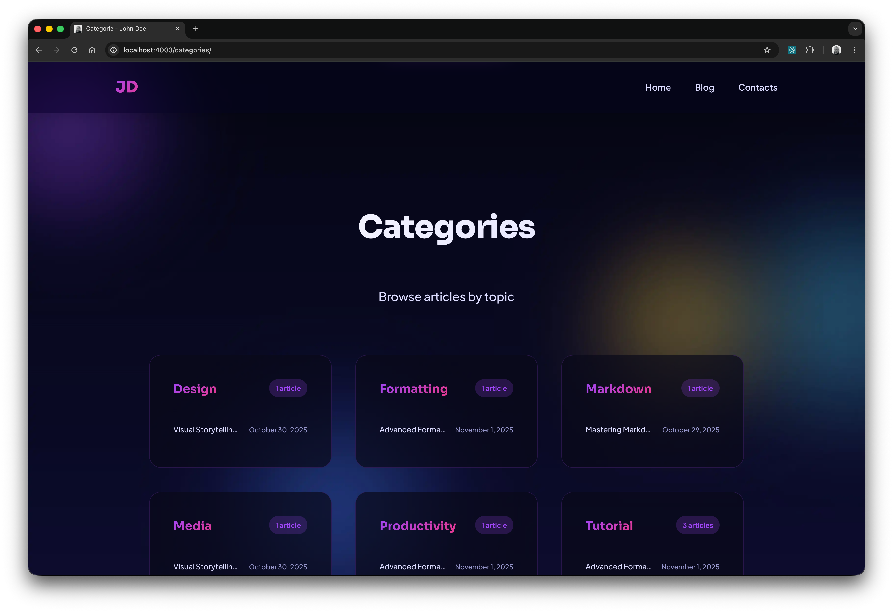

# Tema SexyJekyll

<a href="https://jekyll-themes.com/amargiovanni/sexyjekyll-theme">
  
</a>

Un tema Jekyll moderno y rico en características diseñado para blogs
profesionales y sitios web personales. Construido teniendo en cuenta la
accesibilidad, el rendimiento y la experiencia del usuario.


<div align="center">
  <table>
    <tr>
      <td width="33%"></td>
      <td width="33%"></td>
      <td width="33%"></td>
    </tr>
    <tr>
      <td width="33%"></td>
      <td width="33%"></td>
      <td width="33%"></td>
    </tr>
  </table>
</div>

## Características

### Diseño y Experiencia de Usuario

- **Diseño Moderno**: Estética limpia y minimalista
- **Totalmente Responsivo**: Diseño mobile-first que funciona en todos los
  dispositivos
- **Progreso de Lectura**: Indicador visual que muestra el progreso de lectura
  del artículo
- **Estilos de Impresión**: Diseños optimizados para imprimir

### Contenido y Navegación

- **Búsqueda Avanzada**: Búsqueda instantánea del lado del cliente con resaltado
  de palabras clave
- **Tabla de Contenidos**: Generación automática de TOC para artículos de blog
  con desplazamiento suave
- **Publicaciones Relacionadas**: Recomendaciones inteligentes de posts basadas
  en categorías y etiquetas
- **Categorías**: Filtrado y organización basados en categorías
- **Paginación**: Paginación de posts personalizable

### SEO y Redes Sociales

- **Optimizado para SEO**: Meta etiquetas, Open Graph, Twitter Cards
- **Datos Estructurados**: esquema JSON-LD para mejor comprensión de motores de
  búsqueda
- **Feed RSS**: Generación automática de feed
- **Sitemap**: Sitemap generado automáticamente para motores de búsqueda

### Accesibilidad

- **WCAG 2.1 Nivel AA**: Soporte de accesibilidad integral
- **Saltar al Contenido**: Ayudas de navegación por teclado
- **HTML Semántico**: Puntos de referencia HTML5 adecuados y estructura
- **Etiquetas ARIA**: Amigable con lectores de pantalla
- **Movimiento Reducido**: Respeta las preferencias de movimiento del usuario
- **Alto Contraste**: Excelentes relaciones de contraste de color

### Rendimiento

- **Imágenes Responsivas**: Formato WebP con múltiples tamaños
- **Carga Perezosa**: Las imágenes se cargan según sea necesario
- **CSS/JS Optimizados**: Código minificado y eficiente
- **JavaScript Modular**: Módulos ES6 para mejor mantenibilidad y tree-shaking
- **Tiempos de Carga Rápidos**: Optimizado para rendimiento

### Características para Desarrolladores

- **Resaltado de Sintaxis**: Bloques de código con números de línea (Rouge)
- **Tiempo de Lectura**: Estimación automática del tiempo de lectura
- **Multiidioma**: Sistema completo de i18n que admite inglés, italiano, alemán,
  francés y español
- **Arquitectura Modular**: Separación clara de responsabilidades con módulos
  ES6
- **Compatible con CSP**: Sin manejadores de eventos inline para mayor seguridad
- **Personalizable**: Fácil configuración a través de `_config.yml`
- **Bien Documentado**: Documentación completa incluida

### Características de IA y LLM

- **Soporte llms.txt**: Generación automática de resúmenes de contenido
  amigables con IA
- **llms.txt por Post**: Cada publicación de blog genera su propio archivo
  llms.txt dedicado en `/blog/YYYY/MM/DD/post-slug/llms.txt`
- **llms.txt a Nivel de Sitio**: Archivo llms.txt principal en la raíz con
  descripción general del sitio y estructura de contenido
- **Contenido Estructurado**: Marcado HTML5 limpio y semántico optimizado para
  rastreadores de IA
- **esquema JSON-LD**: Datos estructurados enriquecidos para mejor comprensión
  del contenido
- **Amigable con Rastreadores de IA**: Enfoque acogedor para la indexación de IA
  con instrucciones claras

## Instalación

### Como una Gema de Ruby (Recomendado)

Añade esta línea al `Gemfile` de tu sitio Jekyll:

```ruby
gem "sexyjekyll-theme"
```

Y añade esta línea al `_config.yml` de tu sitio Jekyll:

```yaml
theme: sexyjekyll-theme
```

Luego ejecuta:

```bash
bundle install
```

### Tema Remoto (GitHub Pages)

Si estás usando GitHub Pages, añade esto a tu `_config.yml`:

```yaml
remote_theme: amargiovanni/sexyjekyll-theme
```

### Instalación Manual

1. Descarga o clona este repositorio
2. Copia los archivos a tu sitio Jekyll
3. Actualiza tu `_config.yml` con la configuración del tema

## Inicio Rápido

1. **Instala el tema** usando uno de los métodos anteriores

2. **Configura** tu `_config.yml`:

```yaml
# Configuración del sitio
title: Tu Nombre
email: tu.email@ejemplo.com
description: Descripción de tu sitio
baseurl: ''
url: 'https://tusitio.com'
lang: es # Opciones: en, it, de, fr, es

# Información del autor
author:
  name: Tu Nombre
  email: tu.email@ejemplo.com
  linkedin: https://www.linkedin.com/in/tuperfil/
  bluesky: https://bsky.app/profile/tumanejo

# Logo de navegación
nav_logo:
  type: text # 'text' o 'image'
  text: TN # Tus iniciales o texto
  # image: /assets/img/logo.png  # O ruta a la imagen del logo
  # alt: Tu Logo

# Sección hero
hero:
  name: Tu Nombre
  role: Tu Rol
  subtitle: Tu Empresa o Eslogan
  tagline: Tu eslogan personal
  description: Una breve descripción sobre ti

# Sección blog
blog:
  title: Blog
  description: Descripción de tu blog

# Sección de contacto
contact:
  title: Ponte en Contacto
  description: Descripción de la página de contacto
  links:
    - name: Email
      url: mailto:tu.email@ejemplo.com
      type: email
    - name: LinkedIn
      url: https://www.linkedin.com/in/tuperfil/
      type: linkedin
```

3. **Crea tu primer post** en `_posts/`:

```markdown
---
layout: post
title: 'Tu Primer Post'
subtitle: 'Subtítulo opcional'
date: 2025-11-01
categories: blog tech
---

El contenido de tu post aquí...
```

4. **Ejecuta Jekyll**:

```bash
bundle exec jekyll serve
```

¡Visita `http://localhost:4000` para ver tu sitio!

## Configuración

### Diseños Disponibles

- `default` - Diseño base para todas las páginas
- `home` - Página de inicio con sección hero
- `blog` - Página de listado de blog
- `post` - Post individual del blog
- `about` - Página acerca de
- `contact` - Página de contacto con enlaces sociales
- `category` - Listado de posts específico de categoría
- `404` - Página de error 404 personalizada

### Plugins

El tema utiliza estos plugins de Jekyll:

**Plugins Estándar:**

- `jekyll-feed` - Generación de feed RSS
- `jekyll-seo-tag` - Meta etiquetas SEO
- `jekyll-paginate` - Paginación de posts
- `jekyll-sitemap` - Generación de sitemap
- `liquid_reading_time` - Estimación del tiempo de lectura
- `jekyll_picture_tag` - Imágenes responsivas

**Plugins Personalizados:**

- `llms_txt_generator` - Genera automáticamente archivos llms.txt para cada post
  de blog y crea resúmenes de contenido amigables con IA
- `auto_related_posts` - Sistema inteligente de recomendación de posts basado en
  categorías, etiquetas y similitud de contenido usando algoritmo similar a
  TF-IDF
- `category_generator` - Crea automáticamente páginas dedicadas para cada
  categoría con listados de posts filtrados
- `localized_date` - Filtro Liquid para formatear fechas según el idioma
  seleccionado (por ejemplo, "15 January 2025" en inglés, "15 gennaio 2025" en
  italiano, "15 enero 2025" en español)

### Personalización

#### Colores y Estilos

Edita `css/style.css` para personalizar colores, fuentes y estilos.

#### Enlaces Sociales

Configura los enlaces sociales en `_config.yml` bajo `contact.links`. Tipos
soportados:

- email, linkedin, bluesky, twitter, github, instagram, facebook
- youtube, mastodon, telegram, whatsapp, medium, reddit
- discord, tiktok, twitch, slack

## Documentación

La documentación detallada está disponible en los siguientes archivos:

- [TABLE_OF_CONTENTS.md](docs/TABLE_OF_CONTENTS.md) - Configuración y
  personalización de Tabla de Contenidos
- [I18N.md](docs/I18N.md) - Sistema de internacionalización y soporte de idiomas
- [ACCESSIBILITY.md](docs/ACCESSIBILITY.md) - Características de accesibilidad y
  pruebas
- [SEARCH.md](docs/SEARCH.md) - Funcionalidad de búsqueda
- [READING_PROGRESS.md](docs/READING_PROGRESS.md) - Indicador de progreso de
  lectura
- [STRUCTURED_DATA.md](docs/STRUCTURED_DATA.md) - Datos estructurados SEO
- [TESTING.md](docs/TESTING.md) - Guía de testing y aseguramiento de calidad
- [GIT_HOOKS.md](docs/GIT_HOOKS.md) - Controles de calidad automáticos con Git
  hooks
- [JAVASCRIPT_ARCHITECTURE.md](docs/JAVASCRIPT_ARCHITECTURE.md) - Arquitectura
  JavaScript modular
- [SOCIAL_SHARE.md](SOCIAL_SHARE.md) - Cómo agregar compartición en redes
  sociales (opcional)
- [COMMENTS.md](docs/COMMENTS.md) - Cómo agregar comentarios (opcional)
- [CHANGELOG.md](CHANGELOG.md) - Historial de versiones
- [PUBLISHING.md](PUBLISHING.md) - Guía para publicar tu tema

### Disponible en Múltiples Idiomas

- 🇬🇧 [README.md](README.md) - Inglés
- 🇮🇹 [README.it.md](README.it.md) - Italiano
- 🇩🇪 [README.de.md](README.de.md) - Alemán
- 🇫🇷 [README.fr.md](README.fr.md) - Francés
- 🇪🇸 [README.es.md](README.es.md) - Español

## Compatibilidad de Navegadores

- Chrome (última versión)
- Firefox (última versión)
- Safari (última versión)
- Edge (última versión)
- Navegadores móviles (iOS Safari, Chrome Mobile)

## Contribuciones

¡Las contribuciones son bienvenidas! Siéntete libre de enviar un Pull Request.
Para cambios mayores, abre un issue primero para discutir qué te gustaría
cambiar.

1. Fork el repositorio
2. Crea tu rama de feature (`git checkout -b feature/CaracterísticaIncreíble`)
3. Commit tus cambios (`git commit -m 'Añade CaracterísticaIncreíble'`)
4. Push a la rama (`git push origin feature/CaracterísticaIncreíble`)
5. Abre un Pull Request

## Soporte

Si encuentras algún problema o tienes preguntas:

- Abre un issue en
  [GitHub](https://github.com/amargiovanni/sexyjekyll-theme/issues)
- Revisa la
  [documentación](https://github.com/amargiovanni/sexyjekyll-theme#readme)

## Licencia

Este proyecto está licenciado bajo la Licencia MIT - ver el archivo
[LICENSE](LICENSE) para detalles.

## Créditos

Creado por [Andrea Margiovanni](https://margiovanni.it)

## Agradecimientos

- Construido con [Jekyll](https://jekyllrb.com/)
- Resaltado de sintaxis por [Rouge](https://github.com/rouge-ruby/rouge)
- Iconos e inspiración de diseño de tendencias modernas de diseño web

---

¡Si encuentras este tema útil, considera darle una estrella en GitHub!
